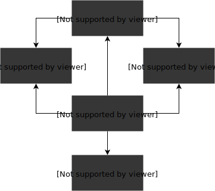

<h1 align="center">
  
</h1>

<h4 align="center">Display, search and copy <a href="https://linuxcontainers.org/lxd/" target="blank">LXC</a> images using a web interface. </h4>

 <p align="center">
  <a href="https://gitter.im/Roche/lxdhub?utm_source=badge&utm_medium=badge&utm_campaign=pr-badge&utm_content=body_badge"></a>
  <a href="https://circleci.com/gh/Roche/lxdhub"></a>
  <a href="https://greenkeeper.io/">https://badges.greenkeeper.io/Roche/lxdhub.svg" alt="Greenkeeper Badge"/></a>
 </p>

<p align="center">
  
</p>

# Purpose

**LXDHub** is a management system for [linux containers (LXC)](https://linuxcontainers.org/). With LXDHub you can visualize **LXC images** of multiple (private & public) remotes. One of the key features of LXDHub is to **clone LXC images** from one remote to another. Therefor you can *mirror* public remotes to your private remote.

# Installation

## Prerequisites

- [lxc >= 3.x](https://linuxcontainers.org/)

The fastest way to run LXDHub on your computer is by pulling the LXDHub LXC image from
our [public remote](https://lxdhub.xyz/remote/lxdhub/images).

```bash
# launch lxdhub
lxc remote add lxdhub https://lxdhub.xyz:8443 --accept-certificate --public
lxc launch lxdhub:lxdhub mylxdhub

# forward the port (let it be accessible from the outside)
lxc config device add mylxdhub lxdhub-web proxy listen=tcp:0.0.0.0:80 connect=tcp:localhost:3000

```

You can now access lxdhub from the machine you launched the container on port 80 (http).
Inside the container lxdhub binds to the port 3000.

Adding your remotes:

```bash

lxc exec mylxdhub -- su -l lxdhub -c "cat << EOF >> ~/lxdhub/lxdhub.yml
  - name: efiks
    url: https://images.efiks.ovh:8443
    protocol: lxd
    public: true
    readonly: true
EOF"

# restart the services
lxc exec mylxdhub -- systemctl restart lxdhub-dbsync.service
lxc exec mylxdhub -- systemctl restart lxdhub.service

```

LXDHub can also be installed with other technologies:

- [Install from source with docker-compose](docs/install-from-source.md)

# Configuration Management

## Ansible

You can also install lxdhub with ansible on any target (ssh/lxd)

*NOTE:* these playbooks were tested in the following environment:

* ansible >= 2.5.1
* Ubuntu
* lxc (snap/native)

one can use the roles in the `ansible` folder to deploy lxdhub on their own server.

```sh
ansible-playbook ansible/install-lxdhub.yml -i REMOTE, [-u USER --key-file SSH_KEY]
```

One can also parametrize the `lxdhub_version` to be checked out as extra-vars.
See the git tags for available versions.

```sh
ansible-playbook ansible/install-lxdhub.yml -e "lxdhub_version=v1.8.0"
```

You can also install lxdhub *inside* a lxd container:

```sh
# setup the continer to install lxdhub in
lxc launch ubuntu:18.04 lxdhub
lxc exec lxdhub -- apt update && apt install python

# install lxdhub inside the lxd container
ansible-playbook ansible/install-lxdhub.yml -c lxd -i lxdhub,
```

This playbook will:

  1. clone and build lxdhub inside the target
  2. setup systemctl services

# Packages

Under the hood, LXDHub is split in five packages. The following graph visualizes the dependencies of each package.



<table>
  <tr>
    <th>Name</th>
    <th>Version</th>
    <th>Description</th>
  </tr>
  <tr>
    <td><a href="https://github.com/Roche/lxdhub/tree/master/packages/web">@lxdhub/web</a></td>
    <td><a href="https://www.npmjs.com/package/@lxdhub/api"></a></td>
    <td>The LXDHub webinterface</td>
  </tr>
  <tr>
    <td><a href="https://github.com/Roche/lxdhub/tree/master/packages/api">@lxdhub/api</a></td>
    <td><a href="https://www.npmjs.com/package/@lxdhub/api"></a></td>
    <td>The REST API for the LXDHub webinterface</td>
  </tr>
  <tr>
    <td><a href="https://github.com/Roche/lxdhub/tree/master/packages/dbsync">@lxdhub/dbsync</a></td>
    <td><a href="https://www.npmjs.com/package/@lxdhub/dbsync"></a></td>
    <td>The script to synchronize multiple LXD remotes with the LXDHub database</td>
  </tr>
  <tr>
    <td><a href="https://github.com/Roche/lxdhub/tree/master/packages/db">@lxdhub/db</a></td>
    <td><a href="https://www.npmjs.com/package/@lxdhub/db"></a></td>
    <td>The package, which provides database functions for the @lxdhub/api and @lxdhub/dbsync packages</td>
  </tr>
  <tr>
    <td><a href="https://github.com/Roche/lxdhub/tree/master/packages/common">@lxdhub/common</a></td>
    <td><a href="https://www.npmjs.com/package/@lxdhub/common"></a></td>
    <td>The package, which provides common functions for all LXDHub-packages.</td>
  </tr>
</table>

The packages `@lxdhub/db` and `@lxdhub/common` are solely libraries, which can not be run seperatly. Whereas the packages `@lxdhub/web`, `@lxdhub/api` and `@lxdhub/dbsync` can be run seperatly via [Docker](https://www.docker.com/) or [NodeJS](https://nodejs.org/en/).

# Tests

## Prerequisites

- [NodeJS >= v9.x.x](https://nodejs.org/en/blog/release/v9.0.0/)
- [LXD >= 2.x.x](https://linuxcontainers.org/lxd/)

## Unit / Integration Tests

Run the automated test cases with NodeJS.

```bash

docker build -t $USER/lxdhub .
docker run -it $USER/lxdhub test
docker run -it $USER/lxdhub lint

```

# Related

- [@lxdhub/web](packages/web/README.md): The LXDHub webinterface
- [@lxdhub/api](packages/api/README.md): The REST API for the LXDHub webinterface
- [@lxdhub/dbsync](packages/dbsync/README.md): The script to synchronize multiple LXD remotes with the LXDHub database
- [@lxdhub/db](packages/db/README.md): The package, which provides database functions for the `@lxdhub/api` and `@lxdhub/dbsync` packages
- [@lxdhub/common](packages/common/README.md): The package, which provides common functions for all LXDHub-packages
- [CONTRIBUTING.md](CONTRIBUTING.md): The contributing guidelines
- [COPYRIGHT](COPYRIGHT): Copyright informations
- [publish.md](docs/publish.md): Documentation on how LXDHub is being published
- [LXC](https://linuxcontainers.org/): The underlying technology behind LXDHub

# People

- [Livio Brunner](https://github.com/BrunnerLivio) - Author
- [Eric Keller](https://github.com/erickellerek1) - Idea
